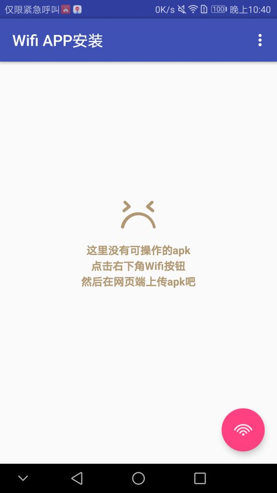
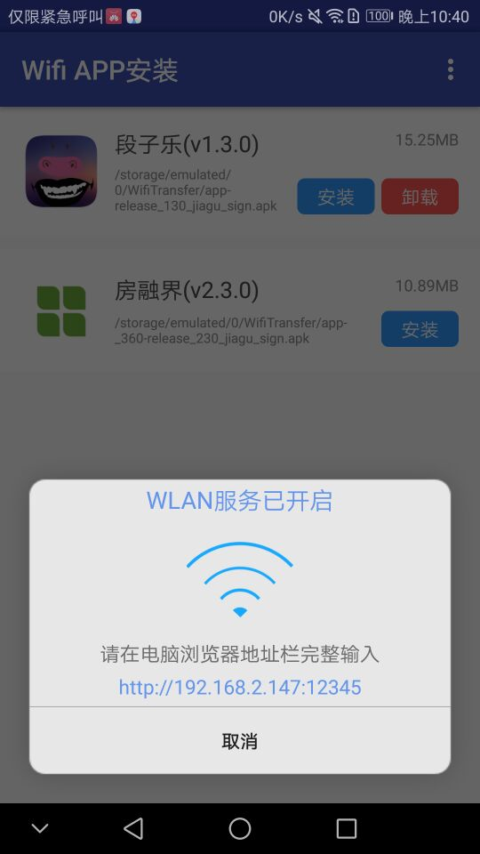
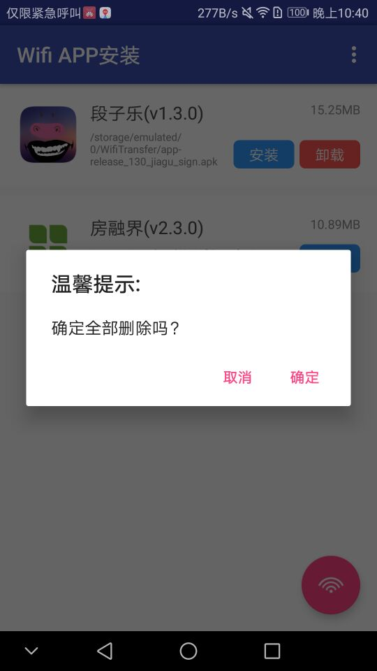
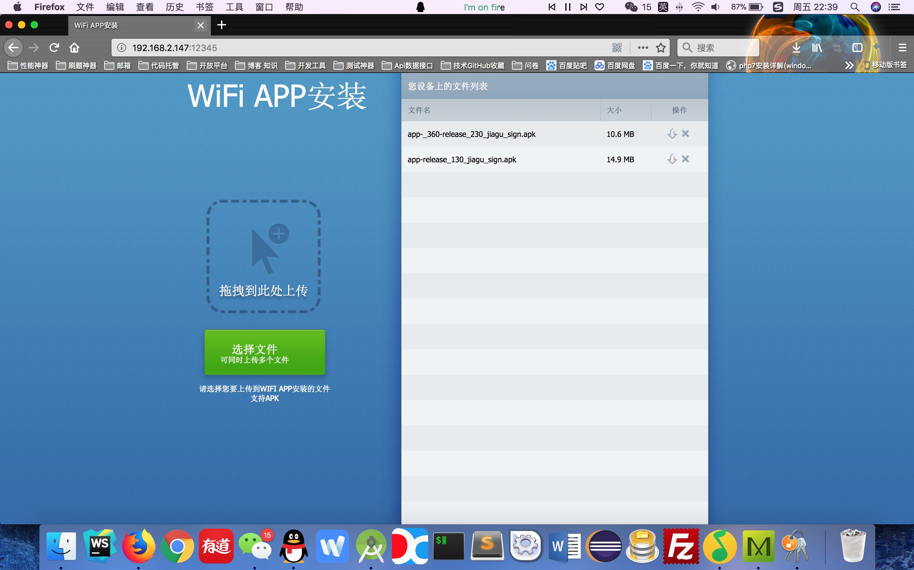

# Android下WIFI隔空apk安装

今天打包了一个apk，然后要安装到手机上，然后数据线可能是被蹂躏久了，有点接触不良，然后就折腾了好久才装上。然后又想到我们平时打包好apk之后都是发送在QQ群里面，然后测试小妹妹会插上数据线一个一个的个测试机安装，然而现在数据线不是通用的，有的数据线是平常用的那种，还有一种是圆角的那种，所以还要插几根线在主机上，实在不方便，所以就有了WIFI 隔空安装APK的想法。

主要就是手机作为服务器，网页上通过WIFI传输数据提交APK到手机上，然后手机端实现对APK的安装和卸载。

----------------

### 手机端截图

### 网页端截图

### 版权声明 
有了这个想法之后，就去找了下资料，真巧，发现了一个网友的博客，正好实现的功能跟我的差不多，多看Android版本WIFI传书的实现 ，实现的是WIFI传书的
功能，主要是Server模块和网页端都写好了，跟我的需求差不了多少，所以花了几小时把他的项目Clone下来改了改

原作者的版权声明：本项目参考《多看》实现的，网页端的资源于《多看》并稍作修改，不得用于任何商业用途，仅供学习研究使用，否则后果自负。

[博客原文地址链接](http://blog.csdn.net/u010998327/article/details/79048792)